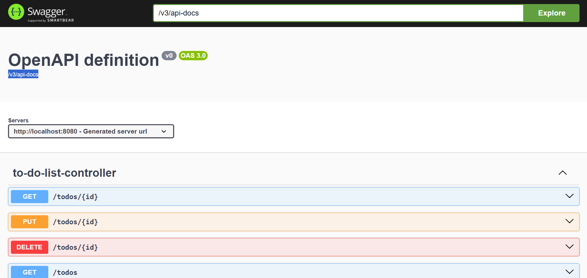

# To-Do Application

A simple To-Do application with a backend built using Java and Spring Boot, and a frontend built using React.

## Table of Contents
- [Features](#features)
- [Installation](#installation)
  - [Backend Setup](#backend-setup)
  - [Frontend Setup](#frontend-setup)
- [Usage](#usage)
- [API Documentation](#api-documentation)
- [Contributing](#contributing)


## Features
- Create, update, and delete to-do items
- Mark to-do items as complete
- Responsive design

## Installation

### Backend Setup
1. **Clone the repository:**
    ```bash
    git clone https://github.com/premganwani619/To-Do-Backend.git
    ```
2. **Navigate to the project directory:**
    ```bash
    cd To-Do-Backend
    ```
3. **Build the project:**
    ```bash
    ./mvnw clean install
    ```
4. **Run the application:**
    ```bash
    ./mvnw spring-boot:run
    ```

The backend should now be running on `http://localhost:8080`.

### Frontend Setup
1. **Clone the repository:**
    ```bash
    git clone https://github.com/premganwani619/To-Do-Frontend.git
    ```
2. **Navigate to the project directory:**
    ```bash
    cd To-Do-Frontend
    ```
3. **Install the dependencies:**
    ```bash
    npm install
    ```
4. **Start the application:**
    ```bash
    npm start
    ```

The frontend should now be running on `http://localhost:3000`.

## Usage
1. Open your browser and navigate to `http://localhost:3000`.
2. Use the input field to create new to-do items.
3. Use the checkboxes to mark items as complete.
4. Use the "Edit" button to modify to-do items.
5. Use the "Delete" button to remove to-do items.

## API Documentation
The backend API is documented using Swagger. You can access the Swagger UI to explore and test the API endpoints at:

[Swagger UI](http://localhost:8080/swagger-ui/index.html#/)

Here is a preview of the Springdoc UI:



## Contributing
Contributions are welcome! Please fork the repository and submit a pull request.

1. Fork the repository.
2. Create a new branch with your feature or bugfix.
3. Commit your changes.
4. Push the branch.
5. Submit a pull request.
